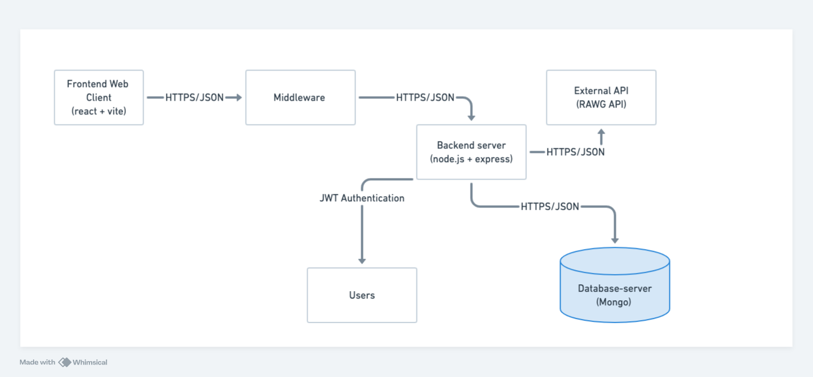
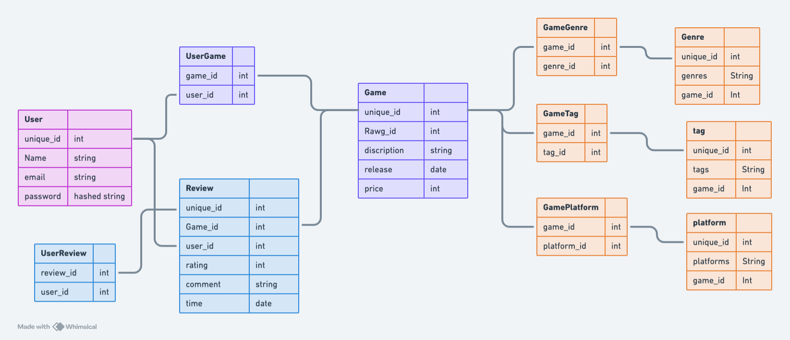
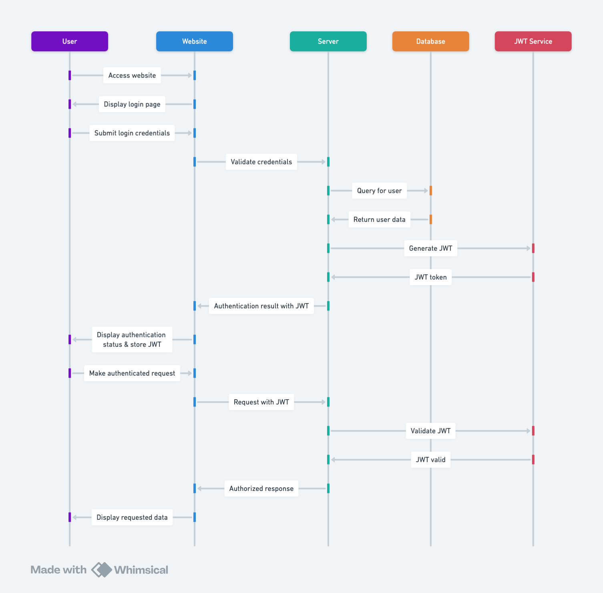

# VideoGameCatalog Architecture

This document describes the overall architecture of the VideoGameCatalog Application.

## Highlevel Component Digram

The client side of the application uses react and vite, it communicates with the middleware. The middleware recieves request from the frontend and process the request to the backend server. The backend uses node.js and express, it communicates with the middleware, mongo database server, and external API. We also use JWT token's for authenticating Users.

## Relationship Diagram

The main entities in our project are users, review, games. 'User' to 'UserGame', is a many to many relationship, as ach 'User' can have zero or more 'Game's and each 'Game' can be associated with zero or more 'User's. 'Game' to genres, tags, and platform are many to many, as sach 'Game' can have multiple of these attributes associated with it, and each of these attributes can be associated with multiple 'Game's. 'User' to review is a one to many relation, as each 'User' can write zero or more 'Review's, but each 'Review' is written by only one 'User'. Further, Game to Review is also one to many as, each 'Game' can have zero or more 'Review's written about it, but each 'Review' relates to only one 'Game'.

## Flow Diagram

A user initiates the process by accessing the website, which then prompts for login credentials. Upon submission, these credentials are validated against the database through the server. If authenticated successfully, the server requests a JWT token from the JWT Service, which generates and returns a token encapsulating user information. This token is then sent back to the user alongside authentication confirmation. For future authenticated requests, the user includes this JWT token, which the server validates with the JWT Service to ensure its authenticity. Upon validation, the server authorizes the request, allowing the website to display the requested data to the user.
